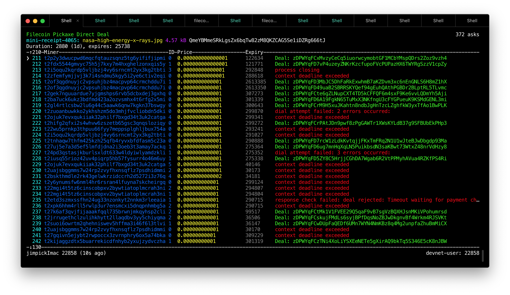

filecoin-pickaxe-direct-deal
============================

**Work-in-progress**

This is a command-line tool for interactively storing "bundles" of
files from [filecoin-pickaxe](https://github.com/filecoin-shipyard/filecoin-pickaxe)
into the Filecoin network.

This front-end program just provides a user interface. It updates a database,
which can be replicated to Filecoin nodes which you control - the
[filecoin-pickaxe-agent](https://github.com/filecoin-shipyard/filecoin-pickaxe-agent)
running on those nodes will conduct any requested deals.

More documentation to come later...

# Related tools

* [filecoin-pickaxe](https://github.com/filecoin-shipyard/filecoin-pickaxe)
* [filecoin-pickaxe-agent](https://github.com/filecoin-shipyard/filecoin-pickaxe-agent)

# License

MIT/Apache-2 ([Permissive License Stack](https://protocol.ai/blog/announcing-the-permissive-license-stack/))
